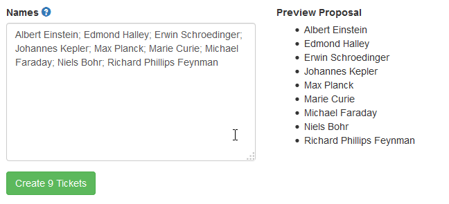

## Create multiple tickets

A ticket is the access authorization for the student to his/her exam. If you have 20 students to take the exam, you have to generate 20 tickets. You can create a single ticket or multiple at once for a given exam. Create a single ticket by the `Actions->Create single ticket` wizard and multiple tickets by the `Actions->Create multiple tickets` wizard.

-----

In this wizard, you can put the names of students in the `Names` field. You can just copy the names from an external source such as an Excel file or another Office application. The names must be separated by a tab, comma, semicolon, newline or all of them combined. The field tries to read the names as you provide them. How the names are parsed, can be seen in the `Preview Proposal` on the right of the `Names` field. You can adjust the names, until the preview is as desired.

After pressing `Create x tickets`, the tickets will be created with default values and you are being redirected to the exam view page. From there you can select `Actions->Generate PDFs` and you will see a PDF file containing all tickets that are in the open state (See [Ticket states](ticket-states.md)) of the current exam. This can be printed out, and provided to the students when taking the exam (See [Taking an Exam](take-exam.md)).