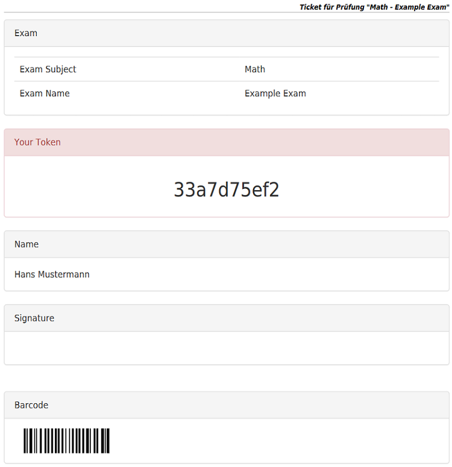

## Create a single ticket

A ticket is the access authorization for the testee to the exam. You can create a single ticket or multiple ones for an exam. Create a single ticket by the [Create single ticket](../ticket/create?mode=single) wizard and multiple tickets by the [Create multiple tickets](../ticket/create?mode=many&type=assigned) wizard.

-----

The ticket token (used to indentify the exam, see [Taking an Exam](take-exam.md)) is automatically generated, you can change it to a value of your desire, but notice that this value must be unique anomg all other ticket tokens.

Set the backup intervall and the time limit if needed and create the ticket by pressing `Create` at the bottom of the page. Now you will be redirected to the view page of the created ticket (See [The ticket view](ticket-view.md)).

Under `Actions->Genrate PDF` you can generate a printable PDF file for this ticket. See the image below for an example ticket.

This PDF should be printed out and given to the student, when taking the exam (See [Taking an Exam](take-exam.md)).