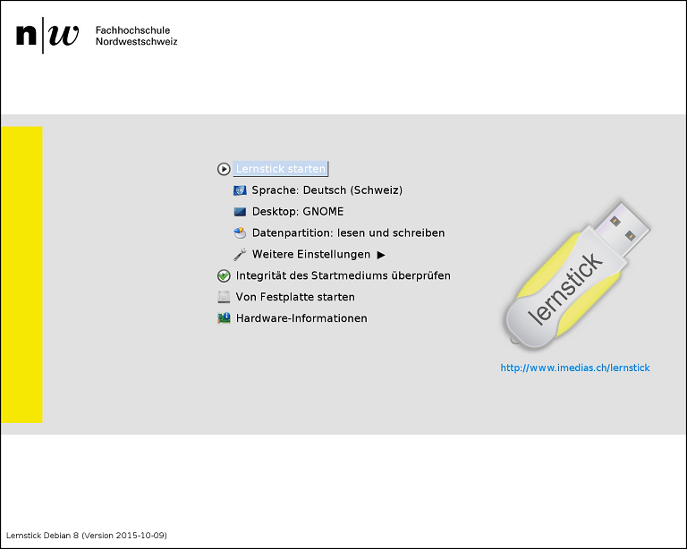

## Create a squashfs-filesystem as exam file

You can also create an exam using a squashfs-filesystem. This is useful when your exam has a more complex form than just a few files at some place in the system. All kinds of exam configurations are possible with a squashfs-filesystem.

To create such an image file, please follow the steps.

----

### Step 1

The first step is to boot [Lernstick Prüfungsumgebung](https://www.imedias.ch/themen/lernstick/index.cfm) on your computer from USB. See the following instructions on how to boot your device from USB:
* [Start from USB-Device (Mac)](https://wiki.lernstick.ch/doku.php?id=anleitungen:systemstart-mac)
* [Start from USB-Device (Windows 10)](https://wiki.lernstick.ch/doku.php?id=anleitungen:systemstart-uefi)

> Please make sure to choose `Datenpartition: lesen und schreiben`, before starting the system:

### Step 2

Once the system has started, you can configure your exam. For example:

* install/uninstall specific applications
* preconfigure applications
* carry specific system configurations, which are not covered in the settings of the `Actions->Create Exam` wizard (Notice that, settings which are covered in the wizard will override settings you configure in the squashfs-filesystem).
* grant/deny advanced permissions to files and directories
* copy files needed in the exam to their locations
* ...

### Step 3

When you finished with the setup for your exam, restart your computer.

> This time it is important to choose `Datenpartition: nur lesen` from the start screen.

### Step 4

Once the system has started again, open the application `Speichermedienverwaltung`.

Choose now `Das System in ein DVD-Abbild konvertieren`.

 Check the box `nur Datenpartition`. You can leave the other options as they are. Press `Weiter` and the squashfs-filesystem will be generated.

Once the process has finished, the `.squashfs` file is then in
	/media/Lernstick-Squashfs/lernstick.squashfs

> You can also start your own operating system and grab the file from the Exchange partititon.

This is the file, which holds all information you configured in step 2. You can now upload it in the `Actions->Create Exam` wizard.