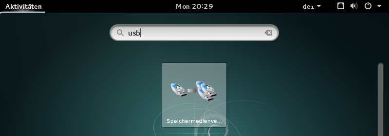

## Create an exam with a squashfs-filesystem

You can create an exam using a squashfs-filesystem. This is useful when your exam has a more complex form than just a few files at some place in the system. All kinds of exam configurations are possible with a squashfs-filesystem.

----

### Step 1

The first step is to boot the computer from USB. See the following instructions:
* [Start from USB-Device (Mac)](https://wiki.lernstick.ch/doku.php?id=anleitungen:systemstart-mac)
* [Start from USB-Device (Windows 10)](https://wiki.lernstick.ch/doku.php?id=anleitungen:systemstart-uefi)

Please make sure to choose `Datenpartition: lesen und schreiben`, before starting the system:

### Step 2

Once the system has started, you can configure your exam. For example:

* install/uninstall specific applications
* preconfigure applications
* specific system configurations, which are not covered in the settings of the [Create Exam](../exam/create) wizard (Notice that, settings which are covered in the wizard will override settings you configure in the squashfs-filesystem).
* grant/deny advanced permissions to files and directories
* copy files needed for exam to their locations
* ...

### Step 3

When you finished with the setup for the exam, restart your computer.

This time it is important to choose `Datenpartition: nur lesen` from the start screen.

### Step 4

Once the system has started, open the application `Speichermedienverwaltung`.

Choose now `Das System in ein DVD-Abbild konvertieren`.

 Check the box `nur Datenpartition`. You can leave the other options as they are. Press `Weiter` and the squashfs-filesystem is generated.

Once the process has finished, the `.squashfs` file is then in
	/media/Lernstick-Squashfs/lernstick.squashfs
This is the file, which holds all information you configured in step 2. You can upload it in the [Create Exam](../exam/create) wizard.

That's it.