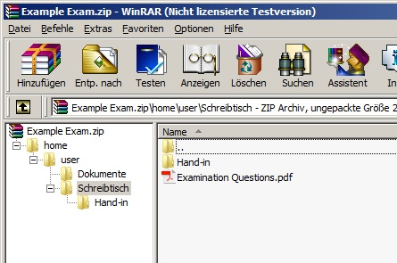
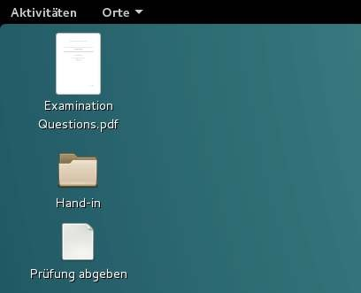
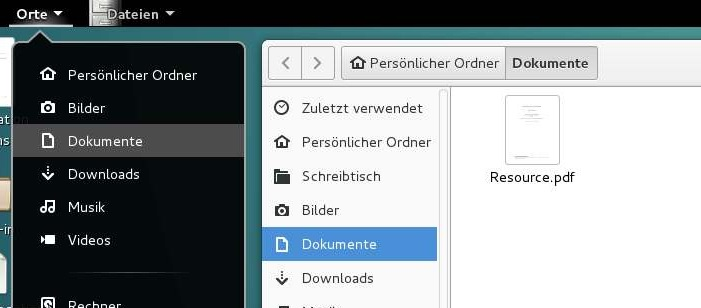

## Create an exam with a zip-file

You can create a zip-file as exam template, if your exam has a very simple structure. For example, when you only need to put a file with the examination questions on the desktop and maybe another resource somewhere else. If your exam does not need special configurations, installed/deinstalled applications or more complex system settings, then the zip-file is the easiest way to go.

If you decide to create a zip-file as exam template, make sure it holds the correct directory structure, so that your files are visible in the exam. All files in the zip-file will be extracted to the exam machine. With a zip-file, it is not possible to create special files or permissions (use a [squashfs-filesystem](create-squashfs-exam-file.md) for that).

The list below contains an example directory structure for an exam:

    /home/
    /home/user/
    /home/user/Schreibtisch/
    /home/user/Schreibtisch/Examination Questions.pdf
    /home/user/Schreibtisch/Hand-in/
    /home/user/Dokumente/
    /home/user/Dokumente/Resource.pdf

The corresponding zip-file would look like this:

If your want to put a file at the Desktop, then drop the file in your zip file to the location `/home/user/Schreibtisch/`. The testee will see all files in his/her exam under the directory where it was dropped in the zip-file. The above zip-file will look as the pictures below in an exam.

It is highly recommended to create a directory like `Hand-in` at the Desktop and advice the testee to put all results in this directory. Even though it might not be necessary, it will be easier to collect the results after the exam is done.

This's it! You exam is ready to be taken. If your exam needs more complex configuration, then please have a look at [Create an exam with a squashfs-filesystem](create-squashfs-exam-file.md).