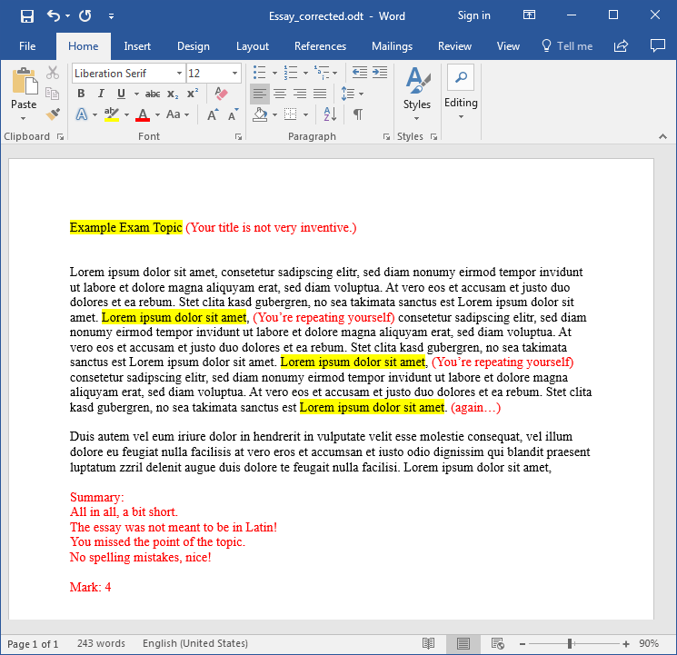

## Example exam: Essay

This is an example walkthrough of an exam from A to Z. In this case it's a relatively simple exam; an essay. This article covers the whole process:

* creating the exam (including the image file)
* generating tickets (multiple at once with a list of names)
* taking the exam (testing the exam)
* generating results
* submit results back

### Goal

The final goal is that the student can write his essay using the [Lernstick-Prüfungsumgebung](https://imedias.ch/themen/lernstick/downloads.cfm) on his own device using a wireless network. The student should not be allowed to access the internet or any other network resource. The whole exam takes about 3 hours. Once the students handed in their essays, we want to retrieve all essays in a compact form for correction.

This example should also act as a future template for slightly modified or very similar exams.

So, let's get started.

### Creating the exam

First we create a new exam, by starting the `Create Exam` wizard under `Actions->Create Exam`.

Next we have to give our exam a *Name* and a *Subject*. I chose `Essay` and `Literature`, because we want to make a literature essay. You are completely free in how you name your exam. This is just for you to identify your exam. You can even use the same name multiple times (though I won't recommend it for the sake of clarity).

The *Time Limit* should be 3 hours, thus `180 minutes`. It must be given in minutes.

The field *Remote Backup Path* will be left as it is, because we don't need to perform a special backup (see [Remote Backup Path](remote-backup-path.md) for more information on this).

In the `General` section, we only check *Take Screenshots* and set an *Interval* of `1 minute`. All other settings should be left unchecked, since we don't need them.

In the section `Libreoffice`, check *Libreoffice: Save AutoRecovery information* with an *Interval* of `1 minute` and also check *Libreoffice: Always create backup copy*. Those flags cause LibreOffice to save a copy of the document all 1 minutes (to recover the document in case of a crash, even if the student never manually saved the document) and to create a backup copy of the document when saving. For more information, please refer to the  aside.

All fields are filled, thus press `Next step`.

----

Now we need to provide an `Exam File`. Since this is a simple exam (we don't need complex system configuration, such as new applications and special settings), we can use a zip file as exam file, as described in [Create a zip-file as exam file](create-zip-exam-file.md).

So we create a zip file on our local computer with the following directory structure:

    /home/
    /home/user/
    /home/user/Schreibtisch/
    /home/user/Schreibtisch/Hand-in/

Then we put in a file named `Essay Topic.pdf` with contents describing the topic of the essay, instructions for the student and where to save the files.

    /home/user/Schreibtisch/Essay Topic.pdf

Make sure, that you also instruct the student to save his/her essay in the directory `Hand-in` placed on the desktop. We created the directory for this purpose. Don't worry, everything the student produces during the exam will be backed up, but later when we [generate the exam results](generate-results.md), it will be much easier, if all exam results are placed at the same location.

Finally, the zip file is done. Of course you can provide more files and directories if you want.

Now press `Add files...` and upload the created zip file. Once the upload has finished, press `Apply` below.

We have now created an exam, now we need to create tickets for the students to take the exam.

### Generating tickets

After pressing `Apply` in the step before, we are now in the [exam view](exam-view.md).

I have a list of students, who should take the exam. Thus, in the exam view, press `Actions->Create assigned Tickets`. This is my example list (though, the essays might be of very high quality):

    Ray Bradbury
    James Joyce
    Leo Tolstoy
    Charles Dickens
    J. R. R. Tolkien
    George Orwell
    Jane Austen
    Mary Shelley
    Franz Kafka
    Agatha Christie

However you can copy the names into the `Names` field and see the preview on the right. For more information on creating multiple tickets please refer to [Create multiple tickets](create-multiple-tickets.md). Now press `Create 10 Tickets`.

We have now 10 Tickets (with names assigned to them) for our exam. Now print the generated PDFs by clicking `Actions->Generate PDFs`. This will take all tickets in the open state (see [Ticket States](ticket-states.md)) assigned to the exam and produce a PDF file. We now have a 10-paged PDF document with all created tickets in it. Every page has the form as seen in [Create a single ticket](create-single-ticket.md). Print the document.

When browsing to `Tickets` in the navigation, you should now see the tickets:

As you can see, all the tickets are in the open state (see [Ticket states](ticket-states.md)) and no start and finish time is set.

We're ready to take the exam.

### Taking the exam

Pick one of the tickets and test your exam. This is fully described in [Taking an exam](take-exam.md), so please refer to this when starting the exam.

From now on I assume you successfully started an exam with one of the tickets. This is how it should look like, after the desktop has loaded.

Notice, the `Essay Topic.pdf` file, we placed in the zip file earlier. There is also the `Hand-in` directory and a button `Finish exam` to finish the exam.

We now open LibreOffice Writer, write an example essay and save the file to the `Hand-in` directory.

Now we finish the exam, by pressing the `Finish exam` button (for details see [Taking an Exam](take-exam.md)).

We have tested the exam and now we continue by generating the exam results for correction.

### Generating exam results

Navigate to `Actions->Generate results`. In the first step we choose the *exam* `Literature - Essay`. We're now asked to configure the resulting zip file with all the exam results in it.

In the *Path* field, type `/Schreibtisch/Hand-in`, because the student was instructed to save all  essays documents in the `Hand-in` directory. This will cause the process to only include files and directories from that location.

We also choose to *Include screenshots*.

On the right side, we can even filter further. The exam was an essay, thus the only files produced are `Word documents`. But take care; if you filter too much, you won't be able to extract all relevant data from the results. However we choose `Word documents` here.

In the *Tickets* field, you can select the tickets. The preselected tickets are the ones which are in the closed or submitted state and with no results handed back yet. Only closed or submitted tickets are available to select.

For more information about the fields, please refer to the  aside or visit [Generate results](generate-results.md).

Press now `Generate ZIP-File` to generate the zip-file.

The zip-file will now have the following structure:

    /Franz Kafka - e0d621cb36/
    /Franz Kafka - e0d621cb36/Screenshots/
    /Franz Kafka - e0d621cb36/Screenshots/screenshot 2018-01-31 11.08.58.jpg
    /Franz Kafka - e0d621cb36/Screenshots/screenshot 2018-01-31 11.09.54.jpg
    (...)
    /Franz Kafka - e0d621cb36/Screenshots/screenshot 2018-01-31 12.05.55.jpg
    /Franz Kafka - e0d621cb36/Essay.odt

In our case, we have only one result in the file, thus we have only one directory in the top level. Those directories are always named `Name - Token`. Inside the directory you find the `Screenshots` directory, since we included the screenshots in the step above. For every minute in the exam, we have a screenshot, as configured in the `Create exam` step above. Last but not least, you see the `Essay.odt` file directly in the directory of the student.

If we'd chosen to exclude the screenshots, it would look like this instead:

    /Franz Kafka - e0d621cb36/
    /Franz Kafka - e0d621cb36/Essay.odt

### Correcting the results

Now, we have to correct the exam, therefore we extract the zip-file somewhere on our local computer and open the documents.

I chose to copy the original document `Essay_corrected.odt` and write my corrections and the mark in there with red color. You can do that in the way you want to, it doesn't matter.

Of course, you can also print the documents, correct them manually and hand them back physically.

However, I removed the `Screenshots` directory, since I don't want the student to see it in the handed back results. This is an example of a corrected essay:

### Submit the corrected results back

Again, we create a zip-file with the same directory structure as the results zip-file. So, we have a directory of the form `Name - Token` for every student. In the corresponding directory are all the corrected files, we want to hand back to the student. My zip-file now looks as follows:

    /Franz Kafka - e0d621cb36/
    /Franz Kafka - e0d621cb36/Essay.odt
    /Franz Kafka - e0d621cb36/Essay_corrected.odt

Notice, in the example `Essay_corrected.odt` is the corrected essay (from the picture above), `Essay.odt` is the original one.

Navigate to `Actions->Submit Results` to start the `Submit results` wizard.

Upload the above created zip-file in the first step and press `Next step`. You will see this:

That's all correct. Since we had only one result, there's only one to hand back. So, we continue by pressing `Submit all results`.

For detailed information about submitting results back, please refer to [Submit results back to the student](submit-results.md).

The student can now get the corrected exam results when navigating to the start page and providing the exam token. See [Get the exam result as a student](get-exam-result.md) for further information.

The student can now download his/her exam results as a zip-file. In our case, the zip-file will look like this:

Both, the original document `Essay.odt` and the corrected one `Essay_corrected.odt` with my correction from above are in there.