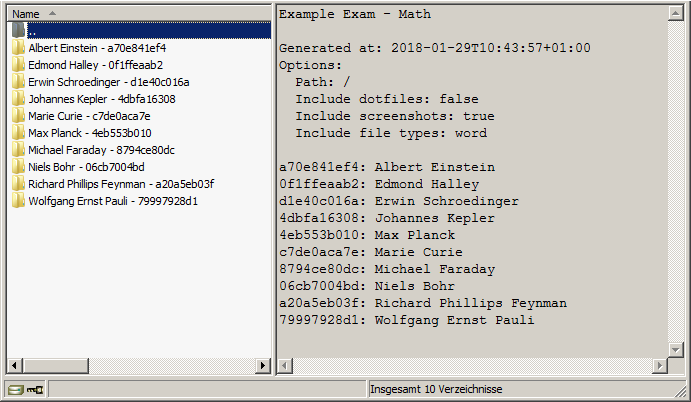

## Generate results

Once the exam is done, you might want to get the results for correction in a simple manner. The exam results can be generated into a small zip-file just containing the essential part of the result data. Which part is essential can be configured by you. This can be done in the `Generate results` wizard. Click `Actions->Generate results` to start generating results.

In the first step, you have to choose the *Exam* to generate results for. Proceed to the next step by clicking the `Next step` button below.

In the second step, the configuration is done. Here you can choose which files should be included in the result. Since the backup process just copied ALL files, you can select which of them are relevant to the exam.

For example, if the students only produce text document files, you can select to include only files that match that criteria (by file ending). *Screenshots* can also be included to the result file. *Hidden files* are in most cases not needed to be included. They are normally related to the user profile and will increase the size of result file significantly. For more information about the different settings in the wizard, please click the  aside.

If you have advised your students to store their result in a specific directory, you can provide it (relative to the [Remote Backup Path](remote-backup-path.md)) in the *Path* field.

You can generate the zip-file as often as you want, until it has the desired form. Below is an example on how such a zip file could possibly look like.

For every student a separate directory is created. The directory name consists of the students name followed by a dash (`-`) and then followed by the ticket token. In each directory you will find the files and directories matching the criteria you set in the wizard.

Once you have generated the results, you can save them to your local computer and correct exam results (See [Correct the exams](correct-exams.md)).