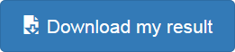

## Get the exam result as a student

Once the exam result is handed back (See [Submit results](submit-results.md)) the student can receive the results over the webinterface.

As a student, just browse to the [start page](../). There is a big blue input field to provide the exam token.

Once there is a result handed back, the student can download it from here.

If there is no result handed back yet, there will also be no download button.