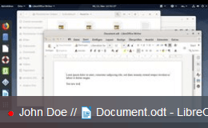

## Monitoring exams

This describes the monitor exams view. It can be reached via `Actions->Monitor Exams` in the top navigation or if you are in the exam view, just click the `Monitor` tab.

Notice that, only tickets in `running` state will be shown in this view. The view is updating automatically if new tickets arrive at or leave the `running` state. Initially there might be no ticket running. The maximum number of screens visible on one page is `12`.

By clicking on the <b>name or token</b> you will be redirected to the corresponding [ticket view](ticket-view.md). Besides the name or token, there is a hint on which window is currently focused/active on the students screen. You will see the icon as well as the name of the window as it is given by the running application (see example image below). If no window is active, there will be neither an icon nor a window name.

The <b>red dot</b> indicates that the system recieves images live, whereas a <b>gray dot</b> indicates that the last recieved image is not live anymore.

This information as well as the image will update in an given interval. You can also click on the <b>image</b> itself. This will open a modal with a live image of the students screen in its native resolution. This image although will not update itself.

> The update interval is specified by the [global setting](system-settings.md) `Monitor refresh interval`. This can be changed in `System->Settings` if you have the permission.
