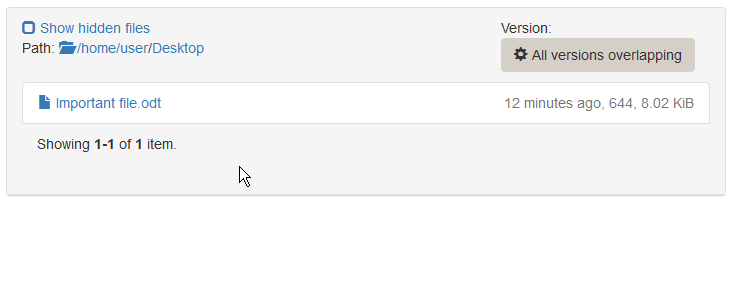

## Restore a specific file

Lets consider one of the students accidentially deleted a file - say `Important file.odt` placed at the Desktop - that is still needed. You can restore any version of the file, which is covered by one of the past backups.

1. Go to the [Ticket view](ticket-view.md) of the affected ticket.
2. Switch to the `Browse backup` tab.
3. Select `All versions overlapping` in the version selection on the right side, so you can see every file that has existed in any point of the history.
4. Browse to the location where the file is missing (`Desktop` in this example). You can check the full path on the top left side.
5. If the file has been present in one of the backup instances, you will now see the file.
6. Hover over the filename and click `View all versions` to get a view of all versions available in the backup. 
7. On the right side of each filename, you see the backup age, the file permissions and its size. The word `current` indicates the latest (current) version of the file. You can click on the filename to directly download the file to your local computer to check if it's the version you want to restore. A crossed out filename means that the file has not existed in that backup or the ones before. If you restore the crossed state, the file will be deleted on the target machine.
8. Once you found the desired version of the file, you can click `Restore this state of the file`.
9. Confirm the restore after carefully reading the warnings. 
10. Wait for the restore to complete.
11. You can check the restore progress and log in the `Restores` tab.
12. On the students computer, browse to the location, where the file was missing and press F5 to reload the directory contents.
13. The file should now be present in the restored version. 
