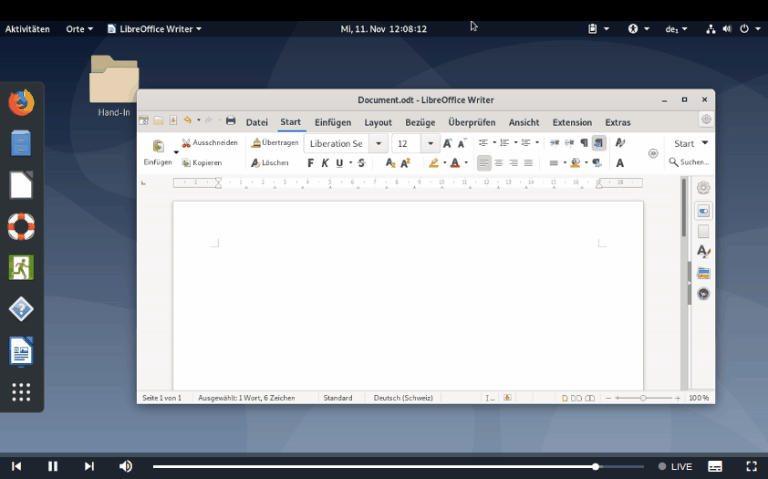

## Screen Capturing

If screen capturing is activated, the system creates <b>a digital recording of the computer screen</b>. The video output can be accessed in the [overview of the corresponding ticket](ticket-view.md) under the tab  `Screen Capture`.

Notice that, this will produce a lot of data as well as traffic and is usually activated in exams that need to be recourse-proof. It serves as well as a backstop for unsaved documents.

Various adjustments can be configured such as:

* frames per second <i>FPS</i>,
* bitrate, that determines the quality of the video stream,
* keylogger (see below).

The capturing is produced using [ffmpeg](https://ffmpeg.org/), a versatile and highly configurable video stream solution. In the settings you will also have the ability to directly adjust the ffmpeg command that is executed on the client system. Using this you can set very advanced flags and options to ffmpeg, for example if you want a webcam overlay in the video stream. This might only be for experienced users and needs to be tested before using in an actual exam!

> If default values for all settings are used, then a average exam that takes <b>3 hours</b> will end up in approximately <b>400MB</b> of data.

If the <b>keylogger</b> feature is enabled as well, all keystrokes will be aggregated into subtitles to the video stream (see an example in the image below).

