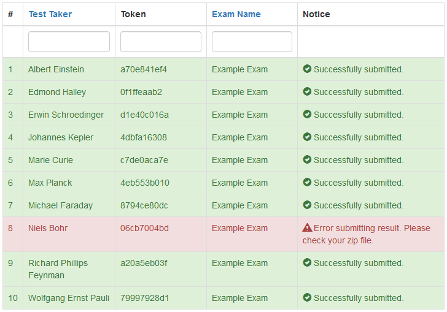

## Submit results back to the student

Assuming you [corrected the exams](correct-exams.md) and created a directory structure of the following form:

    Albert Einstein - a70e841ef4
    Edmond Halley - 0f1ffeaab2
    Erwin Schroedinger - d1e40c016a
    Johannes Kepler - 4dbfa16308
    Max Planck - 4eb553b010
    Marie Curie - c7de0aca7e
    Michael Faraday - 8794ce80dc
    Niels Bohr - 06cb7004bd
    Richard Phillips Feynman - a20a5eb03f
    Wolfgang Ernst Pauli - 79997928d1

Note that each directory has the form `Name - Token`, this needs to be satisfied *exactly*. Assuming that in each directory is the corrected exam of the corresponding student and whatever you want to hand back (maybe a sample solution?). Make sure the directories contain only the parts of the corrected exam, you want the student to see. Remove all other data from the directories.

Once you are done, create a new zip-file with the above contents. It then should look like the [generated zip-file](generate-results.md), just with corrected exams in it.

Start the `Submit results` process now. Click `Actions->Submit results` in the navigation.

### Step 1

In Step 1, upload the zip-file you created just now.

After the submitting process, the student will have access to the result as a zip-file likewise. The contents of each zip-file will be everything inside the corresponding directory of the submitted zip-file. So make sure there is no secret content in it.

Click `Next step`.

### Step 2

You will see a list like the one below.

The uploaded zip-file was scanned and the system found the listed entries in it. The green color suggests that everything is ok with those entries in the zip-file. You can also see, that the exam is successfully identified. In the example above, there are 2 tickets with a result submitted already. This is indicated with yellow color. Please notice, that in such a case already existing results will be overwritten permanently. If you want to remove results from being processed, please edit the zip-file and reupload it in Step 1.

Check the list and then press `Submit all results` to submit all the results in the list.

### Step 3

The list below shows a short summary on which results could be handed back successfully.

In the example, one exam could not be handed back. This happens mostly when the corresponding directory in the uploaded zip-file is empty, so there is nothing to hand back. In such a case you should check the zip-file again.

That's it. The student can now [check his/her exam result](get-exam-result.md).