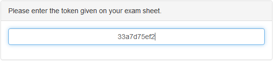
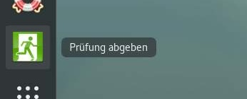

## Taking an Exam

This page describes how to take an exam as a testee.

The first step is to boot the computer from USB. See the following instructions:
* [Start from USB-Device (Mac)](https://wiki.lernstick.ch/doku.php?id=anleitungen:systemstart-mac)
* [Start from USB-Device (Windows 10)](https://wiki.lernstick.ch/doku.php?id=anleitungen:systemstart-uefi)

As soon as the system has started and you have a working network connection, your can search for the exam server.

If the search was successful, you will be prompted for approval. If you approve, you will be prompted for a token. This is the token from the exam sheet (See [Create a ticket](create-ticket.md)).

If your provided a valid token, the download of the exam is initialized and after a while (depending on the size of the exam files) you will see this:

Press `Yes` and the system will restart into the exam (this will take a few minutes). Finally you will see the message below.

Now, the exam has started.

To finish the exam double-click the `Finish exam` icon on the desktop. You should **save all your work** before doing this. **This is not reversible!**

This will initiate the last backup of the exam files and marks your exam as finished. Changes of the exam result from now on will not be saved. You can shut the system down now.