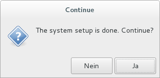
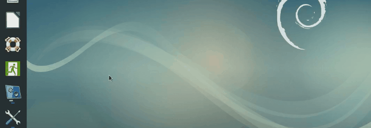

## Taking an Exam

This page describes how to take an exam from the perspective of a student.

The first step is to boot [Lernstick Prüfungsumgebung](https://www.imedias.ch/themen/lernstick/index.cfm) on your computer from USB. See the following instructions on how to boot your device from USB:

* [Start from USB-Device (Mac)](https://wiki.lernstick.ch/doku.php?id=anleitungen:systemstart-mac)
* [Start from USB-Device (Windows 10)](https://wiki.lernstick.ch/doku.php?id=anleitungen:systemstart-uefi)

As soon as the system has started and you have a working network connection, your can search for the exam server by starting the `Search Exam Server` application.

If the search was successful, you will be prompted for approval. You will then be prompted for a token. This is the token given on the exam sheet (See [Create a single ticket](create-single-ticket.md)).

If your provided a valid token, the download and preparation of the exam is done and after a while (depending on the size of the exam files) you will see this:

Press `Yes` and the system will immediately restart into the exam (this will take a moment). Finally you will see a desktop and the message below.

The exam has started now.

----

To finish the exam click the `Finish exam` icon in the "favorite applications" dash. You should **save all your work** before doing this. **This is not reversible!**

This will initiate the last backup of all exam files and marks your exam as finished (See [Ticket states](ticket-states.md)). You will get a notice when the last backup is done, **don't shutdown your computer** before the request message appears. Changes of the exam result from now on, will not be saved.

As soon as the message appears, the exam is done. You can shutdown the system now.