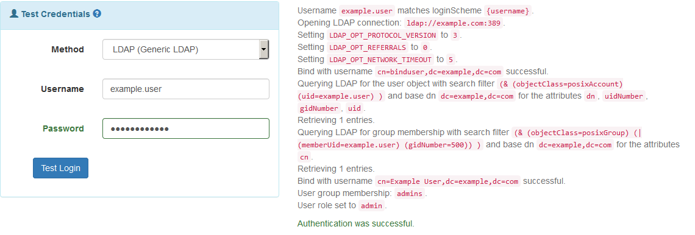

### Test Login

After setting up and authentication method, you should be able to login with user accounts over that autentication method. If the login is not working as desired, you can simulate a login by clicking `Actions->Test Login` in the authentication method view of the desired method or in the authentication method index view. In the dropdown list you can choose ot test the login over a specific authentication method. After providing some test login credentials, you will see debug output on the right hand side. With this additional output, you should be able to figure out the problems that occure during login and adjust your setup. The example image below shows some example debug output that may occure in the successful case:

