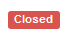

## Ticket states

Currently there are 4 states a ticket can occupy. This is incicated in the [ticket view](ticket-view.md) as one of the following batches:

### The open state

This incicates that a ticket has not been used and there was no activity until now. It is an exam ready to be started. Newly created tickets are usually in the open state.

### The running state

This ticket is in use right now. It indicates an exam being taken by a student at this moment. This means that backups will run on this ticket in the specified interval (all 5 minutes by default). Screenshots (if configured) are taken in the specified interval. The time limit is counting down.

### The closed state

A ticket in the closed state means that the exam has finished and the student has pressed `Finish exam` (See [Taking an Exam](take-exam.md)). It might be possible that the last backup must still be performed in this state, but usually this brands an exam as finished.

### The submitted state

If the ticket is anonymous (hence no `Test taker` is set) and the exam has finished, the ticket will be in the closed state, see above. On the other hand, when a ticket is assigned to a student by providing a name in the `Test taker` field and the student finshed the exam, the ticket will be in the submitted state.
