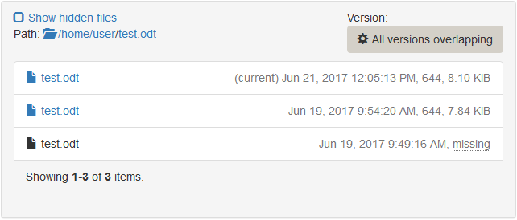

## The ticket view

All data assigned to a particular ticket are visible in the ticket view. It is divided in different tabs. In this view, it is possible to manage the exam before, during and after. Backups can be browsed and [specific versions of files can be restored](restore-specific-file.md) during the exam.

### General

Here you can see the [state](ticket-states.md),  the time at which the exam has started and finished, the duration, whether the ticket is still valid or not (depending on the *Time Limit* you set). The ticket can be assigned to a student by providing his/her name in the *Test Taker* field.

The IP address of the client machine taking the exam is also noted here. To check the connectivity to you can press `Probe`. This will run a check, to see if the client is online or not right now.

### Activity Log

This is a log of all client activity on this ticket. You can see every change of the clients state. If a client looses its network connnection and reconnects back, it will create a log entry for this event. If a backup fails, you will see a log entry.

### Backups

All backup related settings and data can be seen here, including the time of the last successful backup and the last try.

Below is a short data breakdown of *every* single backup, that has been performed on this ticket.

Under `Actions->Show Log File` you can view the whole backup log.

### Browse Backup

In this tab you can browse the backup. This is useful, when you have to restore one specific file or directory to a state in the past (See [restore a specific file](restore-specific-file.md)). Select the date of the backup you want to browse or choose `All version overlapping` if you don't know the date and time of the file you want to find.

`All version overlapping` means that you will see every file that has existed somewhere along the time period of all backups performed, even if it has been deleted at any time. If you then hover over the file name and click `View all versions`, you will see a list of all versions of that particular file. On the right side, the date and time, its size and permissions are given. `(current)` indicates that this is the current version of the file, as it is in the latest backup. `missing` means that the file has not yet existed or does not anymore exist at that time.

### Screenshots

If you configured your exam to take screenshots in an interval, you will see them in this tab. On one hand this is to monitor the student during the exam. On the other hand this can be used to reconstruct the work in progress, if the student forgets to save his/her files. Therefore, it is recommended to activate screenshots and set the interval to a moderate value.

### Restores

All restore related data can be seen here.

Below is a short data breakdown of *every* single restore, that has been performed on this ticket.

Under `Actions->Show Log File` you can view the whole restore log.
